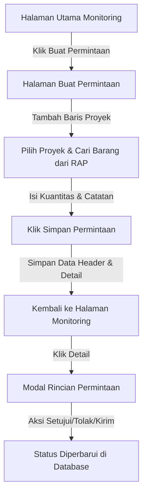

# Product Requirement Document (PRD)
## Fitur Permintaan Barang Ke Gudang (Monitoring & Permintaan)

---

## 1. Latar Belakang & Deskripsi Fitur
Dalam manajemen proyek konstruksi, proses pengadaan barang dan material ke lapangan memerlukan pencatatan yang sistematis. Fitur **Permintaan Barang ke Gudang** dirancang sebagai tahap awal (fase pengajuan) di mana pelaksana proyek dapat mengajukan kebutuhan bahan dan alat untuk satu atau beberapa proyek sekaligus ke pihak gudang. 

Pada fase ini, fokus sistem adalah pada pencatatan **dokumen pengajuan (Permintaan)** dan **rincian barang yang diajukan (Permintaan Detail)**, tanpa melibatkan modul pengiriman barang terlebih dahulu.

---

## 2. Tujuan
1. Menyediakan halaman pemantauan (monitoring) terpusat untuk semua pengajuan permintaan barang ke gudang.
2. Memudahkan pengguna lapangan mengajukan material/alat dengan cepat melalui pencarian otomatis (autocomplete) berdasarkan Rencana Anggaran Pelaksanaan (RAP) proyek bersangkutan.
3. Mendukung pembuatan satu dokumen pengajuan yang mencakup kebutuhan untuk beberapa proyek sekaligus.
4. Menyediakan antarmuka manajemen status dokumen permintaan bagi pihak gudang/logistik.

---

## 3. Alur Kerja Pengguna (User Flow)

---

## 4. Rancangan Database (Skema Tabel)

### A. Tabel `permintaan` (Header Dokumen)
Menyimpan informasi utama dokumen pengajuan permintaan barang.

*   `id` (`INT`, Primary Key, Auto Increment, Unsigned): ID unik dokumen permintaan.
*   `nomor_permintaan` (`VARCHAR(50)`, Unique, Not Null): Format penomoran otomatis (contoh: `REQ/YYYYMMDD/XXXX`).
*   `tanggal_permintaan` (`DATE`, Not Null): Tanggal diajukannya permintaan.
*   `pemohon_id` (`INT`, Not Null): ID pengguna yang mengajukan permintaan (relasi ke tabel `pengguna`).
*   `status` (`ENUM('draft', 'pending', 'disetujui', 'ditolak', 'selesai')`, Default `'draft'`): Status dokumen permintaan.
*   `keterangan` (`TEXT`, Nullable): Catatan umum/instruksi pengiriman untuk gudang.
*   `created_at` (`DATETIME`): Tanggal dibuat.
*   `updated_at` (`DATETIME`): Tanggal diperbarui.

### B. Tabel `permintaan_detail` (Item Rincian)
Menyimpan daftar material atau alat yang diminta. Karena satu permintaan dapat mencakup beberapa proyek, kolom `id_project` diletakkan di tingkat detail item.

*   `id` (`INT`, Primary Key, Auto Increment, Unsigned): ID unik item detail.
*   `id_permintaan` (`INT`, Unsigned, Not Null): Relasi ke tabel `permintaan.id` (Foreign Key - Cascade on Delete).
*   `id_project` (`INT`, Not Null): ID proyek yang membutuhkan barang tersebut (relasi ke tabel `projects`).
*   `id_rap_detail_item` (`INT`, Nullable): Referensi opsional ke item RAP jika material merujuk langsung ke anggaran (`rap_detail_item`).
*   `nama_barang` (`VARCHAR(255)`, Not Null): Nama barang yang diminta.
*   `jumlah` (`DECIMAL(15,4)`, Not Null): Jumlah barang yang diminta.
*   `satuan` (`VARCHAR(50)`, Not Null): Satuan barang (misal: `pcs`, `zak`, `m3`).
*   `keterangan` (`TEXT`, Nullable): Catatan spesifik per item barang.
*   `created_at` (`DATETIME`): Tanggal dibuat.
*   `updated_at` (`DATETIME`): Tanggal diperbarui.

---

## 5. Kebutuhan Fungsional Halaman (Tampilan)

### A. Halaman Monitoring (Halaman Utama)
Halaman awal untuk memantau status seluruh permintaan barang yang telah diajukan.

1.  **Card Ringkasan Informasi (Stats Cards)**
    *   **Total Permintaan**: Total akumulasi semua dokumen pengajuan.
    *   **Menunggu (Pending)**: Jumlah permintaan yang membutuhkan persetujuan/belum diproses.
    *   **Diproses (Disetujui)**: Jumlah permintaan yang sedang dipersiapkan oleh gudang.
    *   **Terkirim (Selesai)**: Jumlah permintaan yang sudah selesai dikirim ke lapangan.
2.  **Filter Status Cepat**
    *   Tombol navigasi untuk memfilter list berdasarkan status: **Semua**, **Menunggu**, **Diproses**, **Terkirim**, dan **Ditolak**.
3.  **Daftar Riwayat Permintaan (History List)**
    *   Menampilkan data permintaan dalam bentuk kartu (card) informatif.
    *   Setiap kartu menampilkan: Nomor Permintaan, Badge Status, Jumlah Proyek & Item, Tanggal Pengajuan, Badge Proyek terkait, Catatan Gudang, serta Tombol **Detail**.
4.  **Modal Rincian Permintaan (Detail AJAX Modal)**
    *   Saat tombol **Detail** diklik, modal popup akan memuat data detail via AJAX.
    *   Data barang dikelompokkan secara visual berdasarkan nama proyek tujuan.
    *   Menyediakan tombol aksi transisi status (misal: tombol **Setujui** & **Tolak** jika status masih *pending*, dan tombol **Kirim** jika status *disetujui*).

### B. Halaman Buat Permintaan Baru
Formulir input untuk membuat dokumen pengisian baru.

1.  **Struktur Blok Proyek Dinamis (Multi-Project Support)**
    *   Pengguna dapat menambahkan baris pengajuan proyek lain dengan mengklik tombol **"Tambah Proyek Lain"**.
    *   Masing-masing blok proyek dapat dihapus secara independen menggunakan tombol hapus (ikon trash).
2.  **Pemilihan Proyek & Autocomplete Pencarian Barang**
    *   Setiap blok proyek memiliki dropdown untuk memilih nama proyek aktif.
    *   Setelah proyek dipilih, sistem memuat data material & alat dari RAP proyek tersebut ke memori lokal.
    *   Pengguna dapat mengetik di kolom pencarian bahan/alat dan mendapatkan hasil autocomplete instan.
    *   Jika bahan/alat tidak ada di daftar RAP, pengguna tetap dapat menginput item kustom secara manual dengan mengetik nama item baru.
3.  **Manajemen Kuantitas & Catatan**
    *   Setiap item yang dipilih akan ditambahkan ke daftar tabel di bawah kolom pencarian.
    *   Pengguna dapat mengisi jumlah (kuantitas) barang dan catatan khusus per item.
4.  **Catatan Umum & Pengiriman**
    *   Di bagian bawah form, terdapat textarea opsional untuk menulis pesan/catatan global bagi petugas gudang.

---

## 6. Kriteria Penerimaan (Acceptance Criteria)
1.  Skema tabel database `permintaan` dan `permintaan_detail` terpasang dengan benar di database.
2.  Pemilihan proyek pada form pembuatan permintaan berhasil memuat barang-barang yang sesuai dengan RAP proyek terpilih.
3.  Satu transaksi pengiriman data form berhasil menyimpan satu record `permintaan` dan banyak record `permintaan_detail` dengan relasi `id_project` yang tepat.
4.  Statistik jumlah pengajuan di halaman utama (card) harus diperbarui secara waktu nyata (real-time/sesuai data DB).
5.  Detail barang pada modal detail terkelompok rapi berdasarkan proyek tujuan masing-masing.
